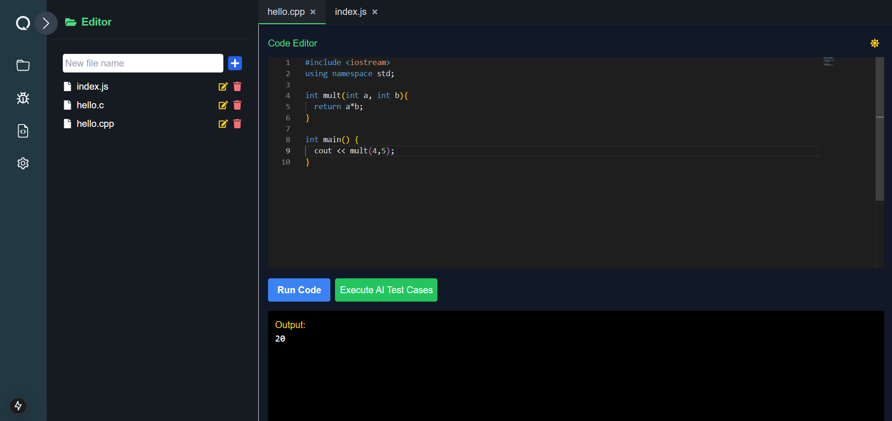
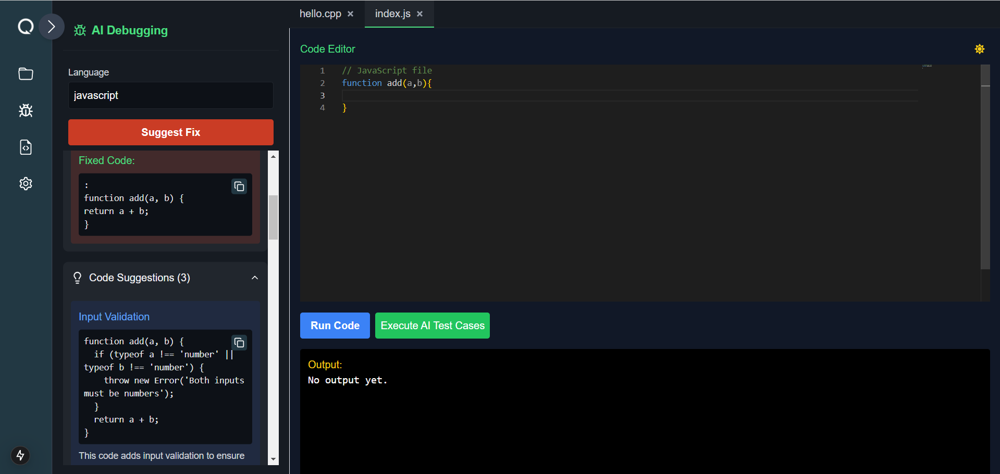
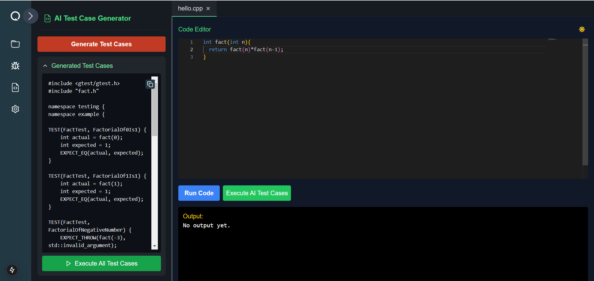

#  Qubex - AI-Powered Intelligent IDE


An advanced, lightweight code editor with **AI-driven** code completion, bug fixing, test case generation, and refactoring features. Built using **Next.js (App Router) with API routes**, **Monaco Editor**, **Cohere AI**, and **Socket.IO**.

## ✨ Features

### 🔹 **Core Features**
- **Code Editor**: A powerful Monaco-based editor with syntax highlighting, auto-indentation, and bracket matching for a seamless coding experience.
- **AI-Powered Code Assistance**: Provides real-time intelligent code suggestions and completions to speed up development.
- **AI Debugging Assistant**: Detects and fixes bugs instantly, offering explanations and corrections.
- **Automated Test Case Generation**: AI analyzes code and generates test cases tailored to different programming languages.
- **Code Refactoring**: Optimizes code for readability, efficiency, and maintainability with AI-powered recommendations.
- **File Management**: Users can create, rename, and delete files within an intuitive file explorer.
- **Multi-Language Support**: Supports C, C++, Python, JavaScript, TypeScript, Java, and more.

### 🎨 **UI/UX Enhancements**
- **Sidebar Navigation**: Expandable/collapsible sidebar for easy access to various features.
- **Theme Toggle**: Seamless switching between **dark** and **light** themes for user preference.
- **Dropdown Output View**: Execution results are displayed in a collapsible section, enhancing user experience.

---

## 🛠️ Tech Stack

| **Technology** | **Purpose** |
|---------------|------------|
| **Next.js (App Router)** | Frontend & API backend |
| **TypeScript** | Type safety and improved development experience |
| **Monaco Editor** | Code editor for an enhanced IDE experience |
| **Cohere AI API** | AI-driven code assistance and debugging |
| **Socket.IO** | Real-time collaboration and code execution |
| **Tailwind CSS** | UI styling and responsiveness |

---

## 🚀 Installation & Setup

### 1️⃣ **Clone the repository**
```bash
git clone https://github.com/hemanvithapullela0456/qubex.git
cd qubex
```

### 2️⃣ **Install dependencies**
```bash
npm install
# or
yarn install
```

### 3️⃣ **Set up environment variables**
Create a `.env.local` file and add the following:
```env
NEXT_PUBLIC_COHERE_API_KEY=your_cohere_api_key
NEXT_PUBLIC_SOCKET_SERVER=http://localhost:3001
NEXT_PUBLIC_JUDGE0_API_KEY=your_judge0_api_key
```

### 4️⃣ **Run the development server**
```bash
npm run dev
# or
yarn dev
```

The IDE will be available at **[http://localhost:3000](http://localhost:3000)**.

---

## 📌 API Endpoints & Feature Descriptions

### 🔹 **1. Execute Code**
- **Description**: Allows users to run code in multiple programming languages using the **Judge0 API** for execution.
- **Route**: `POST /api/execute-code`



### 🔹 **2. AI Bug Fixing**
- **Description**: Detects errors in the provided source code and suggests fixes.
- **Route**: `POST /api/ai-bug-fixing`



### 🔹 **3. Generate Test Cases**
- **Description**: Generates comprehensive test cases based on function logic to ensure reliability. 
- **Different testing frameworks are used based on the programming language:**
  - **JavaScript**: Jest
  - **C**: CUnit
  - **C++**: Google Test (GTest)
  - **Python**: PyTest
  - **Java**: JUnit
- **Route**: `POST /api/generate-test-cases`



### 🔹 **4. Code Refactoring**
- **Description**: Improves code structure, formatting, and readability using AI-driven suggestions.
- **Route**: `POST /api/code-refactoring`


---

## 🎯 Future Enhancements
- 🔹 **Real-time collaboration** (multi-user live coding with WebSockets)
- 🔹 **AI-powered documentation** (auto-generate function/method documentation)
- 🔹 **Multi-file execution** (allow running multiple files together)
- 🔹 **Integration with GitHub** (save & sync code directly from GitHub)

---

## 🙌 Contributing
We welcome contributions! Please fork the repo, create a feature branch, and submit a **pull request**.

---

## 📜 License
This project is **MIT Licensed**.

---
